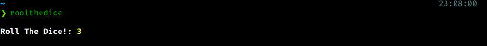
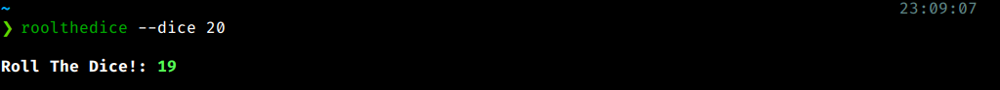
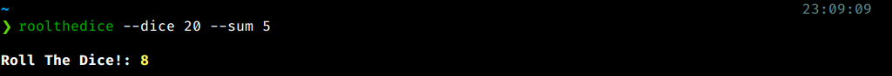
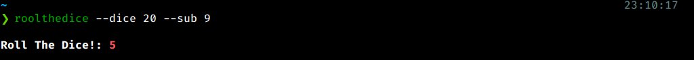

# roolthedice

**Rool The Dice!** Is a CLI program to rool dices of any type, 6 sides, 8 sides, 20 sides, or any number. And you can Sum ou Sub number of the dice rool result, especially for RPG's

# Usage

Type `roolthedice` or `rtd` to rool only a six sides dice.

Pass the argument `--dice [NUMBER]` to set the dice sides.

You can sum the result of the dice with a number, using `--sum`

And you can sub the result of the dice with another number, using `--sub`

